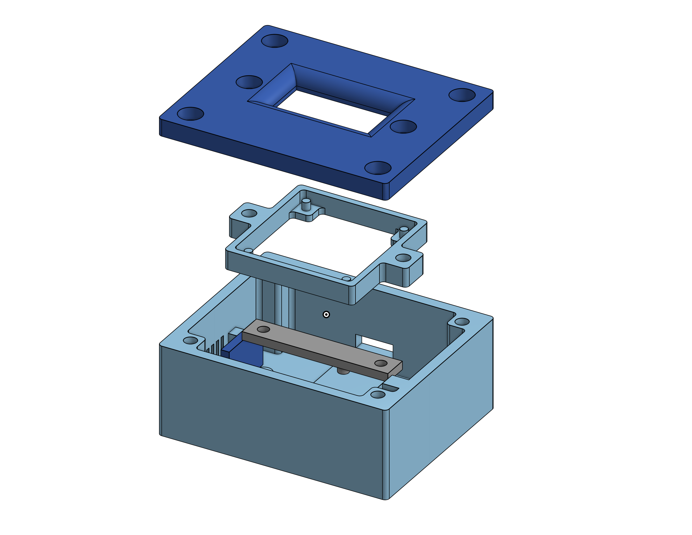
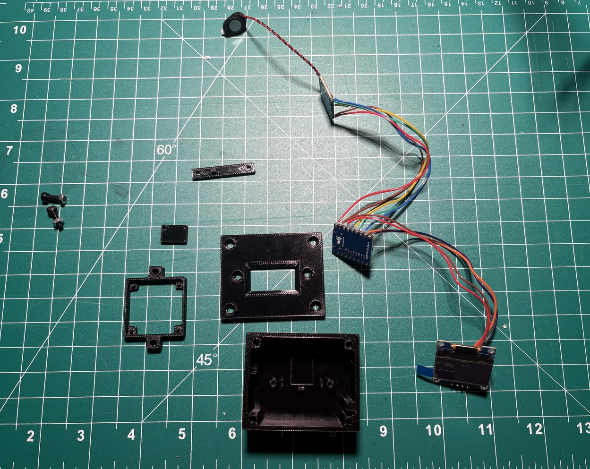
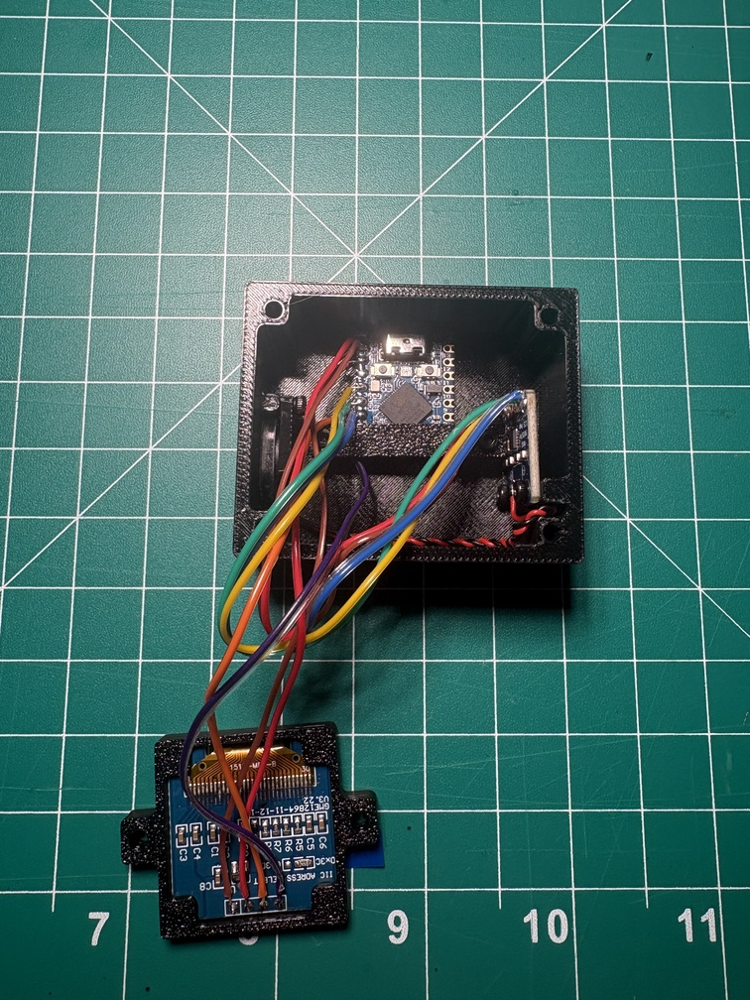
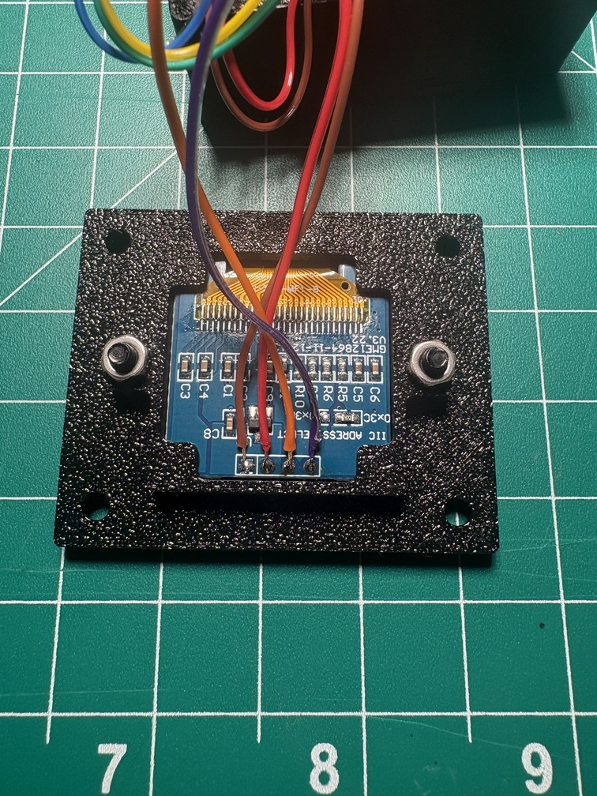
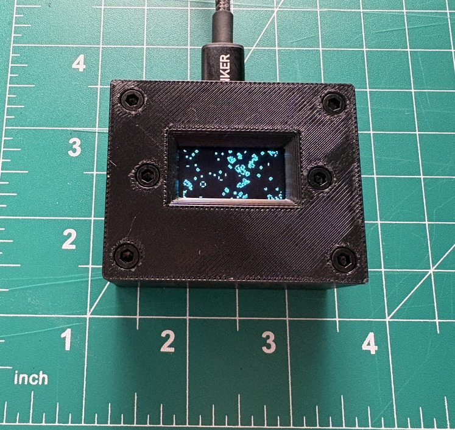

# Conway Box
A little box that shows Conway's Game of Life, along with sound generated from an IFFT of the display grid. Powered by an ESP32-S3.

### Demo
<video src="https://github.com/user-attachments/assets/7ba70371-9f28-4dbb-a9c6-34d36f742512" width="640" controls></video>

### Parts
| Part |
| ------------- |
|Waveshare ESP32-S3-Zero|
|SSD1306 OLED Display 128x64|
|MAX98357A breakout board|
|1W 8-ohm mini speaker|

### Project images

